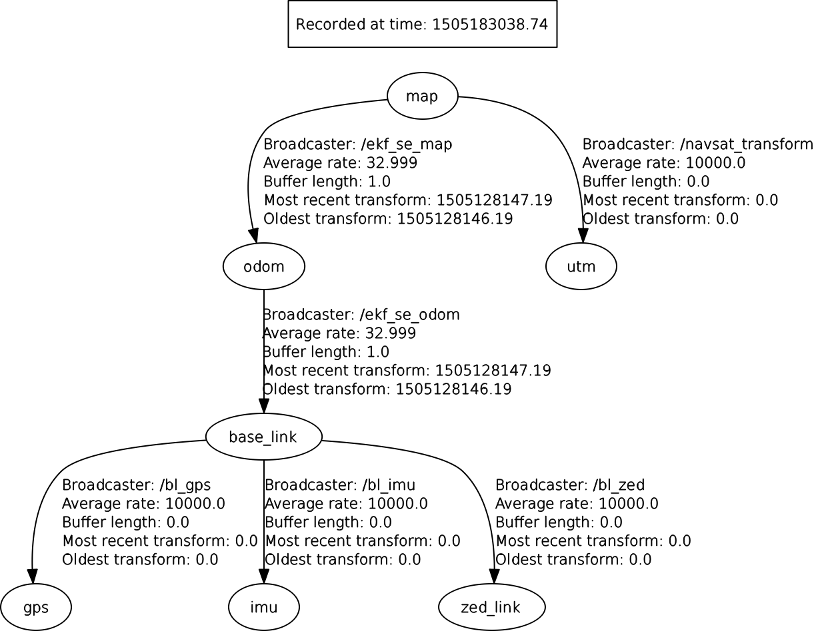

In this package, I have implemented ROS localization on the sensor rosbags recorded on the driverless car.

To use this package, first clone it in your catkin workspace and then do a catkin build/ catkin_make.
After this, do:

		roslaunch car_localization_test car_localization_dual.launch

The main files to checkout are: car_dual_ekf_navsat_example.yaml  and car_localization_dual.launch. Both these files include comments.

The bag directory contains bag files created by running msg_corrector scripts(https://github.com/gutsy-robot/rosmsg_corrector) on the bag files created from the car sensors. In the example, I have only used the all.bag file.

This is the how the rqt_graph and tf_tree for this package looks like:

 

