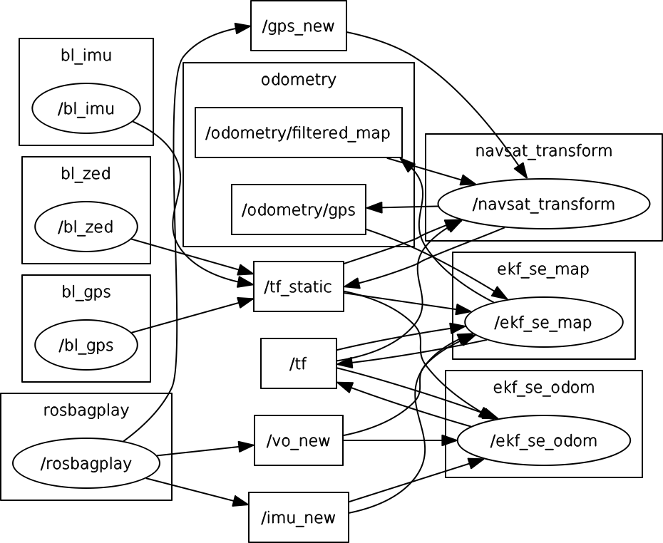

After cloning and doing a catkin_make / catkin build,

Do a :

	roslaunch robot_localization dual_ekf_navsat_example.launch 

To verify that this publishes to the /odometry/gps, in another terminal do a:

	rostopic echo /odometry/gps

I have added static transforms from base_link to imu_link and from gps to base_link(as this was giving errors). But the child_frame_id on the /odometry/gps topic is still being showed as ' ', which needs to be fixed.

This is the flow between the nodes:

